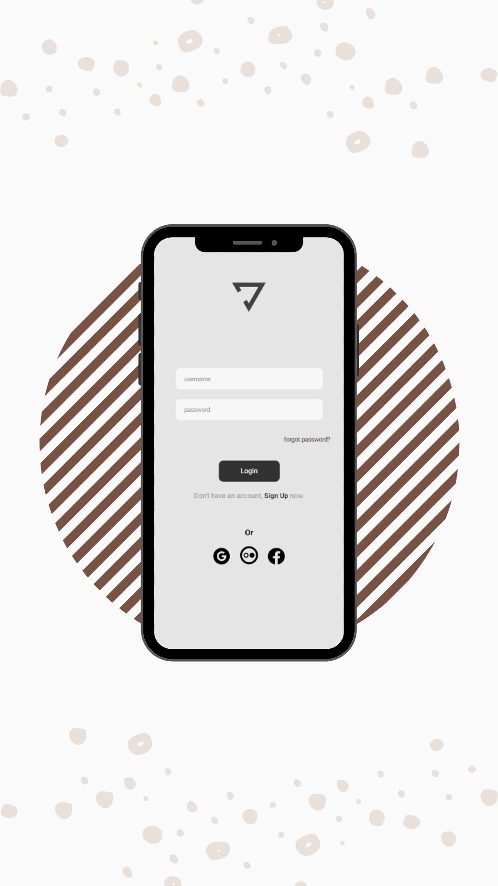

# YOGA 2.0

> Yoga Interface.

### Projetado para ser útil aos amantes de Yoga.

O projeto ainda está em desenvolvimento e as próximas atualizações serão voltadas nas seguintes tarefas:

- [x] Disponibilizar vários exercícios.
- [x] Estimular a tarefas diárias.
- [x] Auxiliar no auto controle da mente.
- [ ] Apresentar os benefícios adquiridos.
- [ ] Incentivar a prática de exercícios.

## 🚀 Instalando <Yoga>

Para instalar o <Yoga> baixe o app.

## 🤝 Colaborador

<table>
  <td>
    <td align="center">
      <a href="#">
         
        
          <b>Selma Dias</b>
        
      </a>
    </td>
    
        
   
 
</table>

[⬆ Voltar ao topo](#YOGA) 

